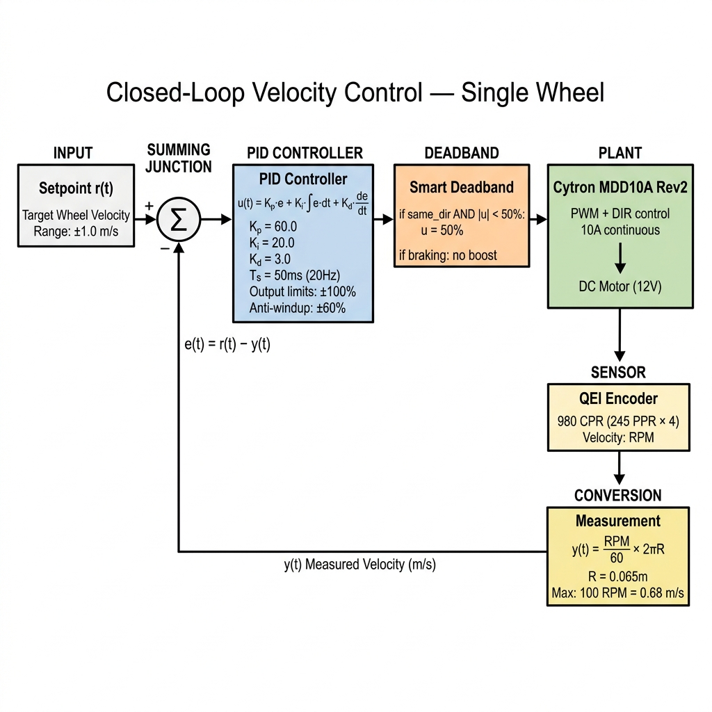
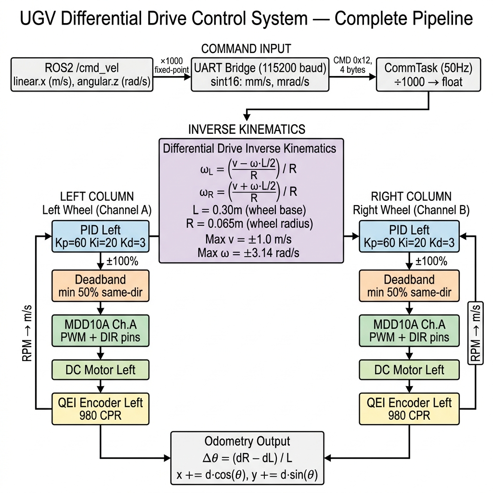

# Robot Control Module

## Overview

This module implements a **closed-loop PID velocity controller** for a differential drive UGV (Unmanned Ground Vehicle). It receives velocity commands from the ROS2 navigation stack via UART and controls two DC motors via a **Cytron MDD10A Rev2** dual-channel motor driver with QEI encoder feedback.

## Closed-Loop Control Block Diagram

## Complete System Pipeline (Dual PID)

## Hardware

### Motor Driver: Cytron MDD10A Rev2

| Spec | Value |
|:---|:---|
| Channels | 2 (Dual H-Bridge) |
| Continuous Current | 10A per channel |
| Peak Current | 30A per channel |
| Input Voltage | 5V – 30V |
| Control Interface | **PWM + DIR** (per channel) |
| PWM Frequency | Up to 20 kHz |
| Logic Level | 3.3V / 5V compatible |

### QEI Encoders

| Spec | Value |
|:---|:---|
| Type | Quadrature (A/B channels) |
| PPR | 245 |
| CPR (×4 decoding) | 980 |
| Max RPM | 100 |
| Max Measurable Velocity | 0.68 m/s |

### Robot Physical Parameters

| Parameter | Symbol | Value |
|:---|:---|:---|
| Wheel Radius | R | 0.065 m |
| Wheel Base | L | 0.30 m |
| Max Linear Velocity | v_max | ±1.0 m/s |
| Max Angular Velocity | ω_max | ±3.14 rad/s |

## PID Configuration

| Parameter | Value | Purpose |
|:---|:---|:---|
| Kp | 60.0 | Proportional gain |
| Ki | 20.0 | Integral gain |
| Kd | 3.0 | Derivative gain |
| Sample Time | 50 ms (20 Hz) | PID update period |
| Output Range | ±100% | Maps to PWM duty cycle |
| Integrator Limits | ±60% | Anti-windup clamp |
| D on Measurement | Enabled | Prevents derivative kick on setpoint change |
| D Filter Alpha | 0.05 | Low-pass filter on derivative term |

### Tuning Guide

| Symptom | Fix |
|:---|:---|
| Motors oscillate (crackle back/forth) | Decrease Kp, increase Kd |
| Motors too slow to start | Increase deadband minimum or Ki |
| Motors overshoot then correct | Decrease Kp, tighten integrator limits |
| Motors hum but don't move | Increase deadband minimum |

## Smart Deadband

The deadband only boosts PWM when the PID **agrees** with the target direction. This prevents violent oscillation caused by applying full braking power.

| Target Direction | PID Direction | PWM < 50% | Action |
|:---|:---|:---|:---|
| Forward | Forward | Yes | **Boost to 50%** |
| Forward | Forward | No | Pass through |
| Forward | Reverse (braking) | — | **No boost** (gentle brake) |
| Zero | — | — | Force PWM = 0 |

## State Machine

| State | ID | Motors Allowed | Transition |
|:---|:---|:---|:---|
| INIT | 0 | ❌ | → IDLE (after Robot_Init) |
| IDLE | 1 | ✅ | → RUNNING (on velocity cmd) |
| RUNNING | 2 | ✅ | → IDLE (on zero cmd + timeout) |
| ESTOP | 3 | ❌ | → IDLE (on Robot_Resume) |
| FAULT | 4 | ❌ | Requires system reset |

## Files

| File | Role |
|:---|:---|
| Robot_Control.h | Public API, physical constants, type definitions |
| Robot_Control.c | PID loop, kinematics, odometry, state machine |
| ../Tasks/App_ControlTask.c | FreeRTOS task — bridges queue to Robot_Control |
| ../Tasks/App_commTask.c | Parses UART packets, computes wheel speeds, sends to queue |

## Testing

Drive forward at 0.3 m/s for 5 seconds:

    timeout 5 ros2 topic pub -r 10 /cmd_vel geometry_msgs/msg/Twist "{linear: {x: 0.3}, angular: {z: 0.0}}"

Rotate in place:

    timeout 5 ros2 topic pub -r 10 /cmd_vel geometry_msgs/msg/Twist "{linear: {x: 0.0}, angular: {z: 0.5}}"
